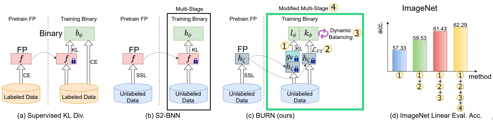

# The Official Implementation of BURN (Binary Unsupervised RepresentatioN learning)
**Unsupervised Representation Learning for Binary Networks by Joint Classifier Learning**<br>
Dahyun Kim, Jonghyun Choi<br>
CVPR 2022 [[Paper](https://arxiv.org/abs/2110.08851)]

## Overview


### Abstract
Self-supervised learning is a promising unsupervised learning framework that has achieved success with large floating point networks. 
But such networks are not readily deployable to edge devices. 
To accelerate deployment of models with the benefit of unsupervised representation learning to such resource limited devices for various downstream tasks, we propose a self-supervised learning method for binary networks that uses a moving target network. 
In particular, we propose to jointly train a randomly initialized classifier, attached to a pretrained floating point feature extractor, with a binary network. Additionally, we propose a feature similarity loss, a dynamic loss balancing and modified multi-stage training to further improve the accuracy, and call our method BURN. 
Our empirical validations over five downstream tasks using seven datasets show that BURN outperforms self-supervised baselines for binary networks and sometimes outperforms supervised pretraining.

### Results
Results on the linear evaluation downstream task on ImageNet for various representation learning methods.<br>
For more details, please refer to our [paper](https://arxiv.org/abs/2110.08851).

|         Method        | Top-1 (%) |
|:---------------------:|:---------:|
| Supervsed Pretraining |   64.10   |
|          SWAV         |   49.41   |
|          BYOL         |   49.25   |
|      Tuned MoCov2     |   52.50   |
|         S2-BNN        |   61.50   |
|    **BURN (Ours)**    | **62.29** |


**Note**: our *unsupervised* representation learning method achieves competetive performance with *supervised* pretraining in many of the tested downstream tasks.

**Note**: this repository is largely based on an earlier version (e.g. OpenSelfSup) of [this library](https://github.com/open-mmlab/mmselfsup).

## Maintainer
* [Dahyun Kim](mailto:kdahyun@upstage.ai)

## Installation

### Docker Containers
We recommend using the below Docker container as it provides comprehensive running environment.
You will need to install `nvidia-docker` and its related packages following instructions [here](https://github.com/NVIDIA/nvidia-docker). 

Pull our image uploaded [here](https://hub.docker.com/r/killawhale/burn) using the following command.
```console
$ docker pull killawhale/burn:latest
```
You can then create the container to run our code via the following command.
```console
$ docker run --name [CONTAINER_NAME] --runtime=nvidia -it -v [HOST_FILE_DIR]:[CONTAINER_FILE_DIR] --shm-size 16g killawhale/burn:latest bash
``` 
- [CONTAINER_NAME]: the name of the created container
- [HOST_FILE_DIR]: the path of the directory on the host machine which you want to sync your container with
- [CONTAINER_FILE_DIR]: the name in which the synced directory will appear inside the container

### Cloning the Github Repository
Use the following command to clone this repository.
```console
$ git clone https://github.com/killawhale2/burn.git
``` 
### Install OpenSelfSup
Use the following command to install the required library.
```console
$ cd burn
$ pip install -v -e .
``` 
**Note**: you will need to do this step inside the docker container.

## Dataset Preparation

### ImageNet
We use ImageNet for the unsupervised representation learning stage and also for the linear evaluation stage.
Please make a directory named "data" under this repository and download the ImageNet dataset into it.
Then, move the *meta* folder containing lists of images used in the training and validation set such that the folder structure is like the folowwing.

```
data
├── IMAGENET
   ├── train
   ├── val
   └── meta
```

**Note:** The lists in the meta directory assume that the subfolders in train and val (i.e. the classes) are changed to integer ids instead of the synset ids.
Please see the "Dataset Preparation" section from [here](https://github.com/gistvision/bnas) for details.

## Downloading the Weights of the Floating Point Network and Pretrained Weights from BURN
You can download the weights of the floating point network used in BURN from [here](https://drive.google.com/file/d/1kyPA896WwuPlPudrvnZjGckxE9BGYdfc/view?usp=sharing). 
Please make the directory structure using the following command.
```console
$ cd burn
$ mkdir fp_teacher
$ cd ./fp_teacher
$ mkdir moco
``` 
Move the downloaded weights to "fp_teacher/moco/".

You can also down the pretrained weights from BURN from both the [first](https://drive.google.com/file/d/16efpD3asdYfUco61GR71T2DEvhY54T0I/view?usp=sharing) and [second](https://drive.google.com/file/d/1dbZAS3XcE9UWXKUBOlfZnaLT7mDzfKRs/view?usp=sharing) stage of pretraining.
Please make the directory structure using the following command.
```console
$ cd burn
$ mkdir pretrains
``` 
Move the downloaded weights to "pretrains/".

## Unsupervised Representation Learning

We perform unsupervised representation learning in multiple stages.
Only the activations are binarized in the first stage and then both weights and activations are binarized in the second stage.
We load the weights from the first stage when training begins in the second stage.

**Note:** We provide the weights from both the first and second stage of pretraining.

### First Stage of Pretraining
To perform the first stage of training, run the following command.
```console
$ CUDA_VISIBLE_DEVICES=0,1,2,3,4,5,6,7 bash tools/dist_train.sh configs/selfsup/burn/react_burn_stage1_bs2048_accumulate2_ep200_fp16 8
```
The above command will automatically save checkpoints in the directory "work_dirs/selfsup/burn/react_burn_stage1_bs2048_accumulate2_ep200_fp16/".
We should extract the weights for the second stage using the below command.
To perform the first stage of training, run the following command.
```console
$ python tools/extract_weights_for_multi.py ./work_dirs/selfsup/burn/react_burn_stage1_bs2048_accumulate2_ep200_fp16/latest.pth [PATH_TO_WEIGHTS]
```
- [PATH_TO_WEIGHTS]: the path to save the extracted weights to.
  - Recommend something like "pretrained/burn_stage1_ep_200.pth"

### Second Stage of Pretraining
To perform the second stage of training, run the following command.
```console
$ CUDA_VISIBLE_DEVICES=0,1,2,3,4,5,6,7 bash tools/dist_train.sh configs/selfsup/burn/react_burn_stage2_bs2048_accumulate2_ep200_fp16 8 --pretrained [PATH_TO_WEIGHTS]
```
- [PATH_TO_WEIGHTS]: the path to the pretrained weights from the first stage
  - You can use the extracted weights from the first stage or use the provided weights from the first stage at "./pretrains/burn_keep_fc_binact_backbone_cls_tch_cls_ep_200.pth"

### Pretraining with Single Stage
If you do not want to run multiple stages of pretraining, you can just run the following command for pretraining in a single stage.
```console
$ CUDA_VISIBLE_DEVICES=0,1,2,3,4,5,6,7 bash tools/dist_train.sh configs/selfsup/burn/react_burn_stage2_bs2048_accumulate2_ep200_fp16 8
```

After running the second stage of pretraining (or pretraining with single stage), run the following command to extract the weights for downstream tasks.

```console
$ python tools/extract_weights.py ./work_dirs/selfsup/burn/react_burn_stage2_bs2048_accumulate2_ep200_fp16/latest.pth [PATH_TO_WEIGHTS]
```
- [PATH_TO_WEIGHTS]: the path to save the extracted weights to.
  - Recommend something like "pretrained/burn_stage2_ep_200.pth"
  
**Note**: we ran our experiments with at 8 NVIDIA A100s. For running with different number of GPUs please change the `CUDA_VISIBLE_DEVICES` environment variable in the command line and the corresponding images per GPUs used in the various config files accordingly.

## Linear evaluation with Pretrained Weights

To reproduce the results for linear evaluation reported in the paper, you can use the pretrained weights provided [here]().

For running linear evaluation on ImageNet using our pretrained model, use the following command.
```console
$ CUDA_VISIBLE_DEVICES=0,1,2,3,4,5,6,7 bash benchmarks/dist_train_linear.sh configs/benchmarks/linear_classification/imagenet/react_last_full.py [PATH_TO_WEIGHTS]
```
- [PATH_TO_WEIGHTS]: the path to the downloaded pretrained weights
  - You can use the extracted weights from the second stage of pretraining or use the uploaded weights at "./pretrains/burn_keep_fc_backbone_cls_tch_cls_ep_200.pth"
Expected result: 

Roughly 62.2x% Top-1 accuracy.

**Note**: we ran our experiments with at 8 NVIDIA A100s. For running with different number of GPUs please change the `CUDA_VISIBLE_DEVICES` environment variable in the command line and the corresponding images per GPUs used in the various config files accordingly.

## Citation

If you find any part of our code useful for your research, consider citing our paper.

```bibtex
@inproceedings{kimchoi2022BURN,
  title={Unsupervised Representation Learning for Binary Networks by Joint Classifier Training},
  author={Dahyun Kim and Jonghyun Choi},
  booktitle={CVPR},
  year={2022}
}
```

## License

This work is licensed under a [Creative Commons Attribution-NonCommercial 4.0 International License](https://creativecommons.org/licenses/by-nc/4.0/legalcode).

